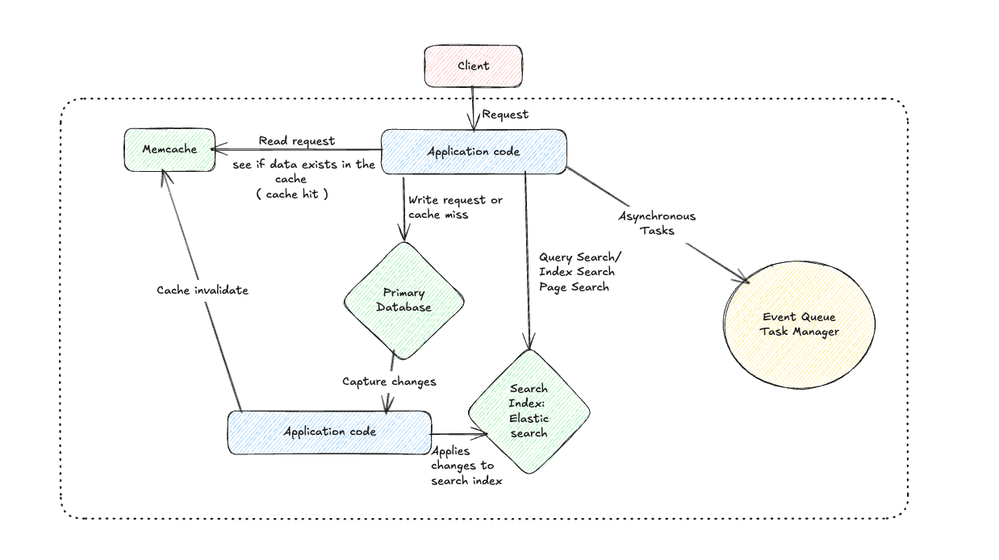

> The notes are inspired from _Designing Data-Intensive Applications by Martin Kleppmann_, but the explanation and examples are my own.

Many software Applications today are *Data Intensive* as opposed to *Compute Intensive* which was a pain point in earlier days, but the amount of CPU is hardly an issue today. Instead, the large amount of data flowing in and out of the applications has been proven as a breakpoint in many scenarios.
For an example, if we consider a real world Data Intensive application, here are some of the ways or tools through which the application might consume or distribute the data.
1) Store the data so that it can be used later: A primary Database
2) Fast retrieval of expensive operations: Some kind of In MemCached
3) Reading/ Searching based on some Query: ElasticSearch
4) Sending Data/ events to some other service or application asynchronously for Stream Processing: Apache Kafka
5) Processing large chunks of Data into smaller chunks: Batch Processing

The first chapter of this book articulates how an application with all these systems blocked together can run smoothly while maintaining Reliability and Scalability

## Thinking about Data Systems

As listed above many tools or methods to store or retrieve the Data in an Application. Some of us might get confused that the intricacies of these tools are totally different. But, in the recent times that line has been blurred as, a MemCache or a message queue both store data for a short amount of time yet their characteristics and retrieval patterns are different. Redis ( an in-memory database ) can be used as a message queue, while Apache Kafka is very durable for storage.
But, since the high demand of Data ( being in-&-out ) of an application is so wide, that a single tool cannot meet all the requirements like data processing, or faster search indexes etc. Hence, all these tools are stitched together to form a Data System that can handle large volumes of data going in and out of an application.

Consider this example of an application which uses all the things that we talked about:

As a Engineer, when we build a system like this, or when we encapsulate all these tools under an Application Programming Interface ( API ), we usually hide the intricacies from the end user or the client.
Now, if we are designing a data system that involves these tools, we are bound to encounter some problems and certain guarantees. Pointers like, we should be able to invalidate the cache at every cache miss or a write to the Primary Database, so that clients can see the consistent results. Problems like Event queues should not overload with the asynchronous tasks such that it blocks the main thread of our application code in case of Single Threaded application runtimes like Node.js. 
There are many other factors that can influence the design of systems like these but we are gonna talk about our three main concerns which are:
1) Reliability
2) Scalability
3) Maintainability

## Reliability

Reliability can be referred to as the ability of the system to work correctly even in the face of adversity. It also guarantees that:
- The application should keep working correctly to their peak performance at the time of peak load.
- In case of any fault ( from hardware or software and user ) application should not crash. 
- It should prevent any unauthorised access and abuse from any attack.

So, in simpler terms *Reliability* can be defined as the ability of the Application to work as expected even when the things go wrong.
Now, things which can go wrong are often termed as *Faults*. And, Faults can be from Hardware, Software or from an end user. When we design applications at scale, we often consider these faults in mind and hence, we make a system which is *Fault Tolerant or Fault Resilient*. Also, we cannot anticipate every possible fault beforehand, hence it is not possible to create a system which is 100% fault tolerant. Also, *Fault* and *Failure* are not same. Failure means that our system failed to give the expected result to the user.
There are some methods to invoke faults in our system which can prevent any kind of failure at the production level. For example: killing individual processes at random to see what service or what part of system breaks. The Chaos Monkey from Netflix is a great example of this. 
At last, we cannot prevent fault from happening but since prevention is better than cure, we make our system tolerant to faults.

### Software Errors
Many a times, faults might happen at the system level triggered from some kind of bug inside our software or application code. These bugs stays unattended from our sight, and only appears under specific circumstances when they are triggered by something.
- For example, a software bug that causes every instance of Application server to crash like not setting an input limit to the password field, and then your server might crash taking too long and consuming too much compute to hash the password
- A memory leak filling up the GC
- An asynchronous, event-driven architecture triggering excessive database calls, which is leading to a blockage due to a high row-read count.
All the above examples are the bugs/ software errors which I have faced in my projects.

### Human Errors
Us a Humans are tend to create errors while designing softwares which may get overlook during the development phase but can cause a lot of damage to the end user or the application as a whole.
Here are some of the key approaches to prevent human made errors in the Software.
- Adding an abstraction in the design while writing the software can enforce engineers to follow a safe design pattern unless the abstracted components are too strict and engineers can make their way around it so it's a balance that we need to maintain.
- Preventing unauthorised access to the writers/ developers of the application for the production level data is a safe practice.
- Adding testing at all the levels, from unit tests to Integration testing are valuable for covering edge cases that might come at the operational level.
- Setup detailed monitoring and logging at every level or environment of the application to let you know if any fault or bug arises. Tools like Datadog and Sentry are great for these.

Crux is, Reliability plays a very important role in designing applications whether it's a small piece of software or a software that handles satellite launches. Our system should be reliable to prevent the crash of a satellite or a plane and to prevent the unexpected deletion of all your child photos.

## Scalability
If the system is reliable today, it doesn't mean that it will stay reliable in the future as well. And, one of the most common reasons for that is increasing load. A system is defined as a scalable system or said to have scalability when it can work as expected even when the load is increased.

### Describing Load
Load on any application can be described as a set of numbers which are known as Load Parameters. Good thing with Load Parameters is that, it can be described for any tool or any component of the system. For eg: Load for a web application can be requests per second on a particular page. For a Database, it can be number of Reads on Rows. For cache, it can number of hits and miss. So, be defining the load for a system, we can increase or even decrease the resources required by the component such that our system can scale smoothly.
Now there are different types of Scaling mainly, *Vertical Scaling and Horizontal Scaling* which we'll see later.
For now, to describe the load more concisely, let's take a look at this example from Twitter.